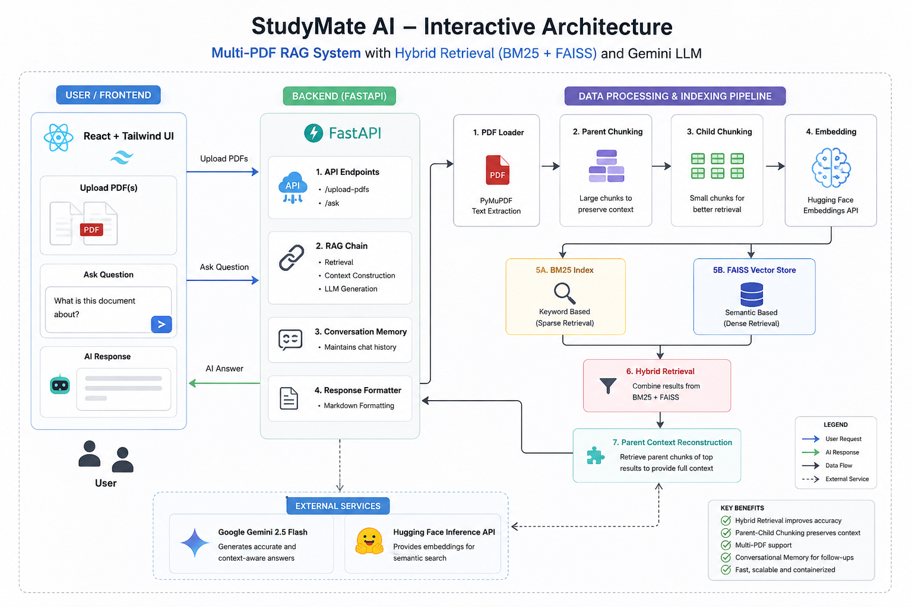
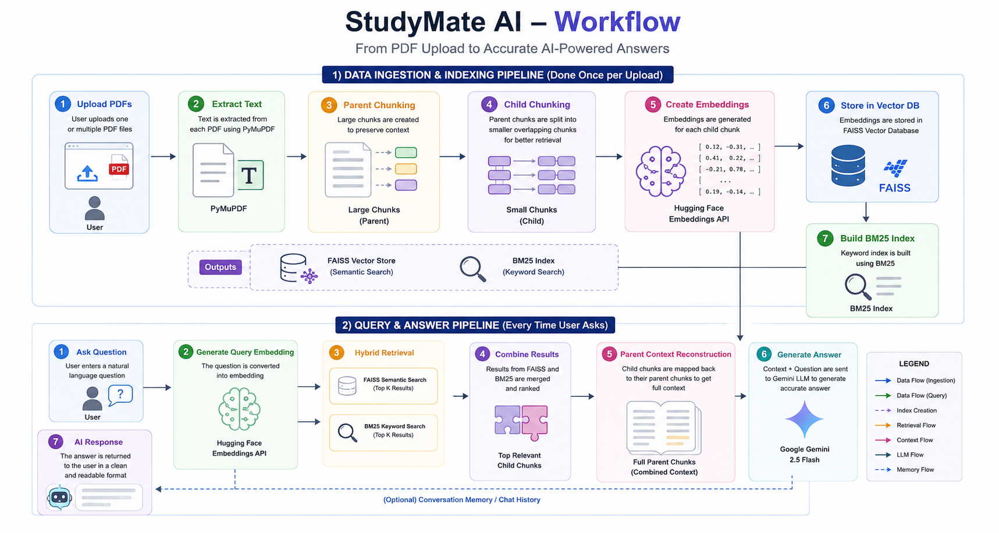

# 📚 StudyMate AI

<p align="center">

🚀 An AI-powered Multi-PDF RAG (Retrieval-Augmented Generation) application that enables students to upload multiple PDF documents and ask natural language questions. The application retrieves the most relevant information using Hybrid Retrieval (BM25 + FAISS) and generates accurate responses using Google's Gemini LLM.

</p>

---

# 🌐 Live Demo

🔗 **Website:

---

# 📷 Screenshots

## 🏠 Home Page

<p align="center">

</p>

---

## 📄 PDF Upload

<p align="center">

</p>

---

## 💬 AI Chat Interface

<p align="center">

</p>

---

# ✨ Features

- 📂 Upload multiple PDF documents
- 🤖 Ask questions in natural language
- 📖 Parent-Child Chunking
- 🔍 Hybrid Retrieval
  - BM25 (Sparse Search)
  - FAISS (Semantic Search)
- 🧠 Google Gemini 2.5 Flash
- ⚡ FastAPI Backend
- ⚛ React + Tailwind Frontend
- 🐳 Dockerized Frontend & Backend
- 📜 Markdown Response Rendering
- 💬 Conversation Memory
- 🎯 Fast semantic retrieval

---

# 🏗 System Architecture

> Replace the image below with your architecture diagram.

<p align="center">

</p>

---

# 🔄 Workflow

> Replace this image with your workflow diagram.

<p align="center">

</p>

---

# ⚙ How It Works

```
User Uploads PDFs
        │
        ▼
PyMuPDF extracts text
        │
        ▼
Parent Chunking
        │
        ▼
Child Chunking
        │
        ▼
Create Embeddings
        │
        ▼
FAISS Vector Database
        │
        ▼
BM25 Index
        │
        ▼
Hybrid Retrieval
        │
        ▼
Parent Context Reconstruction
        │
        ▼
Gemini 2.5 Flash
        │
        ▼
AI Response
```

---

# 🚀 Tech Stack

## Frontend

- React.js
- Tailwind CSS
- Axios
- React Markdown

---

## Backend

- FastAPI
- LangChain
- FAISS
- BM25
- PyMuPDF
- Google Gemini API
- Hugging Face Embeddings API

---

## DevOps

- Docker
- Docker Compose
- Nginx

---

# 📂 Project Structure

```
StudyMate-AI/

│

├── backend/

│   ├── app.py

│   ├── rag_chain.py

│   ├── vector_store.py

│   ├── pdf_loader.py

│   ├── Dockerfile

│   └── requirements.txt

│

├── frontend/

│   ├── src/

│   ├── components/

│   ├── Dockerfile

│   ├── nginx.conf

│   └── package.json

│

├── docker-compose.yml

├── README.md

└── .gitignore
```

---

# 🧠 RAG Pipeline

The application follows a modern Retrieval-Augmented Generation pipeline.

### 1️⃣ Upload PDFs

Users upload one or multiple PDF files.

↓

### 2️⃣ Text Extraction

PyMuPDF extracts text from each document.

↓

### 3️⃣ Parent-Child Chunking

Large parent chunks preserve context while smaller child chunks improve retrieval precision.

↓

### 4️⃣ Embedding Generation

Embeddings are generated using Hugging Face Inference API.

↓

### 5️⃣ Hybrid Retrieval

The system combines

- BM25 Keyword Search
- FAISS Semantic Search

to retrieve the most relevant chunks.

↓

### 6️⃣ Parent Context Reconstruction

Retrieved child chunks are mapped back to their parent chunks.

↓

### 7️⃣ Gemini LLM

Gemini receives the reconstructed context and generates a final answer.

---

# 🐳 Running with Docker

Clone the repository

```bash
git clone https://github.com/isimarjitsingh/StudyMate-AI.git
```

Go inside

```bash
cd StudyMate-AI
```

Create

```
backend/.env
```

Example

```env
GOOGLE_API_KEY=your_google_api_key
HUGGINGFACE_API_KEY=your_huggingface_api_key
```

Run

```bash
docker compose up --build
```

Frontend

```
http://localhost:3000
```

Backend

```
http://localhost:8000/docs
```

---

# 📡 API Endpoints

## Upload PDFs

```
POST /upload-pdfs
```

---

## Ask Questions

```
POST /ask
```

---

# 📈 Future Improvements

- User Authentication
- Chat History Database
- Streaming Responses
- OCR Support
- Image-based PDF Support
- Citation Generation
- Multi-language Support
- Persistent Vector Database
- Cloud Deployment
- Voice Interaction

---

# 🤝 Contributing

Contributions are always welcome.

Feel free to fork this repository and submit a pull request.

---

# ⭐ Support

If you found this project useful,

⭐ Star this repository.

It really helps!

---

# 👨‍💻 Author

**Simarjit Singh**

- GitHub: https://github.com/isimarjitsingh
- LinkedIn: https://www.linkedin.com/in/simarjit-singh-875235313/

---

# 📜 License

This project is licensed under the MIT License.
